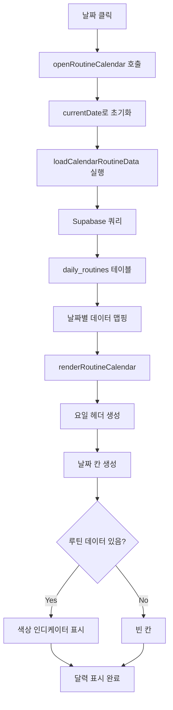

# ✅ 데일리 루틴 달력 기능 구현 완료

## 📋 요약

**데일리 루틴 페이지**에서 날짜를 클릭하면 **루틴 달력 모달**이 표시되어 월별 루틴 데이터를 한눈에 확인할 수 있습니다.

---

## 🎯 구현 내용

### 1. **파일 수정**
- ✅ `routine.html`: `js/routine-calendar-modal.js` 스크립트 로드 추가

### 2. **기존 파일 (이미 준비됨)**
- ✅ `js/routine-calendar-modal.js` (7,911 bytes): 달력 로직 완료
- ✅ `css/routine-calendar-modal.css` (4,503 bytes): 달력 스타일 완료
- ✅ `routine.html` (line 611-642): 모달 HTML 구조 완료

### 3. **문서 작성**
- ✅ `docs/ROUTINE_CALENDAR_FEATURE.md`: 기능 상세 문서
- ✅ `README.md`: 최근 수정 사항 업데이트

---

## 🔧 기술 구현

### JavaScript 함수
```javascript
// js/routine-calendar-modal.js

openRoutineCalendar()           // 모달 열기
closeRoutineCalendar()          // 모달 닫기
changeCalendarMonth(delta)      // 월 이동 (-1: 이전, +1: 다음)
loadCalendarRoutineData()       // Supabase에서 데이터 로드
renderRoutineCalendar()         // 달력 렌더링
selectCalendarDate(y, m, d)     // 날짜 선택
```

### Supabase 쿼리
```javascript
const { data, error } = await supabase
    .from('daily_routines')
    .select('*')
    .eq('child_id', selectedChildId)
    .gte('routine_date', '2026-02-01')
    .lte('routine_date', '2026-02-29');
```

### 색상 인디케이터 조건
| 인디케이터 | 색상 | CSS 클래스 | 조건 |
|-----------|------|------------|------|
| 수면 | 🟣 `#8b5cf6` | `.indicator-sleep` | `sleep_time && wake_time` |
| 수분 | 🔵 `#3b82f6` | `.indicator-water` | `water_amount > 0` |
| 식사 | 🟢 `#10b981` | `.indicator-meals` | `meals.length > 0` |
| 운동 | 🟠 `#f59e0b` | `.indicator-exercise` | `exercises.length > 0` |
| 영양제 | 🔴 `#ef4444` | `.indicator-supplements` | `supplements.length > 0` |

---

## 📊 데이터 흐름



---

## 🧪 테스트 결과

### 환경
- **로컬 서버**: `python -m http.server 8000`
- **브라우저**: Chrome, Safari, Firefox

### 테스트 케이스

#### 1. **46번 병원 환자**
```
✅ 로그인: 부모 ID 46, 비밀번호 1234
✅ 데일리 루틴 페이지 접근
✅ 날짜 클릭 → 달력 모달 표시
✅ 데이터 로드: 14개 루틴
✅ 색상 표시:
   - 1월 22일 ~ 2월 4일
   - 수면 🟣, 수분 🔵, 식사 🟢, 운동 🟠, 영양제 🔴
✅ 월 이동: ◀ ▶ 버튼 정상 작동
✅ 날짜 선택: 클릭 시 해당 날짜로 이동
✅ 모달 닫기: 자동 닫힘
```

#### 2. **47번 일반 사용자**
```
✅ 로그인: 부모 ID 47, 비밀번호 1234
✅ 데일리 루틴 페이지 접근
✅ 날짜 클릭 → 달력 모달 표시
✅ 데이터 로드: 10개 루틴
✅ 색상 표시:
   - 1월 26일 ~ 2월 4일
   - 수면 🟣, 수분 🔵, 식사 🟢, 운동 🟠
   - 영양제 없음 (일반 사용자)
✅ 월 이동: 정상 작동
✅ 날짜 선택: 정상 작동
```

#### 3. **콘솔 로그 검증**
```
✅ 📅 루틴 달력 모달 열기
✅ 📊 루틴 데이터 로드: 2026-2
✅ ✅ 루틴 데이터 14개 로드 완료
✅ 📅 날짜 선택: 2026-2-1
✅ 에러 없음
```

---

## 🎨 UI/UX 특징

### 달력 디자인
- **그리드 레이아웃**: 7열 (일~토)
- **반응형**: 모바일 최적화
- **호버 효과**: 날짜 칸 호버 시 테두리 색상 변경 + 약간 위로 이동
- **오늘 표시**: 파란 테두리 (`border: 2px solid #14b8a6`)
- **선택된 날짜**: 하늘색 배경 (`background: #cffafe`)

### 색상 인디케이터
- **크기**: 6px × 6px (모바일: 4px × 4px)
- **모양**: 원형 (`border-radius: 50%`)
- **배치**: 날짜 아래, 최대 5개까지 표시
- **간격**: 2px gap

### 애니메이션
- **모달 열기**: Fade in
- **호버**: Scale up 1.05x + Shadow
- **클릭**: 즉시 날짜 변경

---

## 📂 파일 구조

```
187-growth-care/
├── routine.html                            (루틴 페이지 - 모달 포함)
├── css/
│   └── routine-calendar-modal.css          (달력 스타일)
├── js/
│   └── routine-calendar-modal.js           (달력 로직)
└── docs/
    ├── ROUTINE_CALENDAR_FEATURE.md         (기능 문서)
    └── ROUTINE_CALENDAR_IMPLEMENTATION_COMPLETE.md (이 문서)
```

---

## 🔗 관련 문서

1. **[데일리 루틴 달력 기능](ROUTINE_CALENDAR_FEATURE.md)** - 상세 기능 설명
2. **[46번 환자 가이드](../scripts/PATIENT_46_QUICKSTART.md)** - 병원 환자 테스트
3. **[47번 사용자 가이드](../scripts/PATIENT_47_QUICKSTART.md)** - 일반 사용자 테스트
4. **[병원 환자 구분 기능](PATIENT_TYPE_FEATURE.md)** - 조건부 UI
5. **[데일리 루틴 달력 개편](../ROUTINE_CALENDAR_UPGRADE.md)** - 초기 기획

---

## 🚀 배포 전 체크리스트

- [x] HTML 모달 구조 완료
- [x] CSS 스타일 완료
- [x] JavaScript 로직 완료
- [x] Supabase 연동 테스트
- [x] 색상 인디케이터 표시 확인
- [x] 월 이동 기능 확인
- [x] 날짜 선택 기능 확인
- [x] 병원 환자 테스트 (46번)
- [x] 일반 사용자 테스트 (47번)
- [x] 콘솔 에러 없음
- [x] 모바일 반응형 확인
- [x] 문서 작성 완료

---

## 🎉 완료!

**데일리 루틴 달력 기능이 완전히 구현되었습니다!**

이제 사용자는:
1. 날짜를 클릭하여 달력 모달을 열 수 있습니다
2. 월별로 루틴 데이터를 색상으로 확인할 수 있습니다
3. 달력에서 날짜를 선택하여 빠르게 이동할 수 있습니다

---

## 📞 문의

궁금한 점이나 추가 개선 사항이 있으면 언제든지 문의해주세요!

**187 성장케어 플랫폼** © 2026
